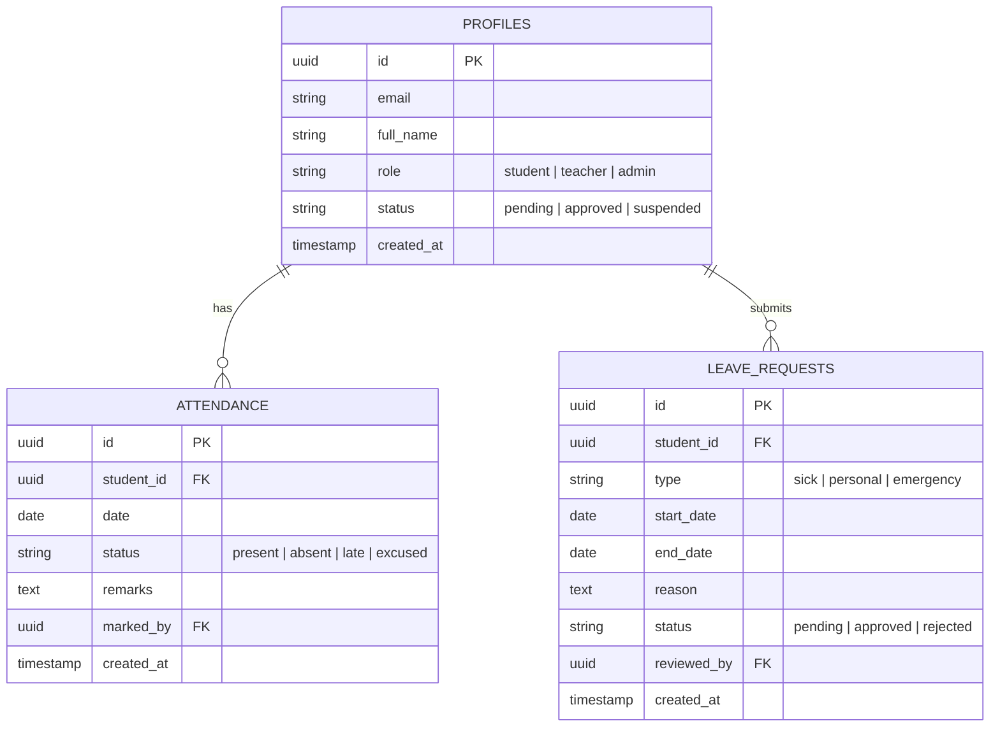

# 🎓 Student Management System (SMS)

A full-stack Student Management System built with **Next.js 16 (App Router)**, **TypeScript**, **Tailwind CSS**, **Shadcn UI**, **Redux Toolkit**, and **Supabase**.

---

## 📑 Table of Contents

- [Overview](#-overview)
- [Tech Stack](#-tech-stack)
- [System Features & Views](#-system-features--views)
  - [1. Authentication & Authorization](#1-authentication--authorization)
  - [2. Student Portal](#2-student-portal)
  - [3. Teacher / Admin Portal](#3-teacher--admin-portal)
  - [4. Automated Email Notifications](#4-automated-email-notifications)
- [State Management & Data Flow](#-state-management--data-flow)
- [Project Architecture](#-project-architecture)
- [Getting Started](#-getting-started)
  - [Prerequisites](#prerequisites)
  - [Installation](#installation)
  - [Environment Variables](#environment-variables)
  - [Database Setup (Supabase)](#database-setup-supabase)
  - [Running the Application](#running-the-application)
- [Database Schema](#-database-schema)
- [Available Scripts](#-available-scripts)
- [License](#-license)

---

## 🌟 Overview

The **Student Management System** is designed to streamline academic administrative workflows for schools and training programs. It provides dedicated role-based portals for **Students** and **Teachers/Admins**, supporting attendance management, leave/sick day application and approvals, analytical reporting with interactive charts, automated credential dispatching, and secure OAuth & email-based authentication.

---

## 🛠️ Tech Stack

- **Framework**: [Next.js 16 (App Router)](https://nextjs.org/)
- **Language**: [TypeScript](https://www.typescriptlang.org/)
- **UI & Styling**: [Tailwind CSS v4](https://tailwindcss.com/) & [Shadcn UI](https://ui.shadcn.com/)
- **State Management**: [Redux Toolkit](https://redux-toolkit.js.org/)
- **Backend & Database**: [Supabase](https://supabase.com/) (PostgreSQL, Row Level Security, Auth, Realtime)
- **Authentication**: Supabase Auth with **Email/Password** & **Google OAuth**
- **Data Visualization**: [Recharts](https://recharts.org/) / Chart.js
- **Email Dispatch**: [Resend](https://resend.com/) / Nodemailer

---

## 🚀 System Features & Views

### 1. Authentication & Authorization
- **Multi-method Auth**: Sign in via Email & Password or Google OAuth.
- **Role-Based Routing**: Automatic redirection and route protection for `Student` and `Teacher` roles.
- **Account Approval Gate**: Prevents unapproved student accounts from accessing privileged features until teacher/admin verification.

### 2. Student Portal
- **Attendance View**: Real-time overview of personal attendance history (Present, Absent, Late, Excused) with calendar & list views.
- **Ask Leave**: Submit leave or sick day requests specifying date ranges, leave category, and justification.
- **View Reports & Statistics**: Visual dashboard showcasing attendance percentages, absence trends, and leave analytics via interactive charts.

### 3. Teacher / Admin Portal
- **Dashboard & Analytics**: Comprehensive overview of class metrics, attendance percentages, and pending leave requests using dynamic visual charts.
- **Attendance Record**: Mark and update daily attendance records for batches, classes, or individual students.
- **Approve Leave / Sick Requests**: Review submitted student leave applications with options to approve or reject with remarks.
- **Add Student**: Register new students with automatically generated random secure passwords.
- **Student Approval**: Review, verify, and approve new student registrations before granting active portal status.

### 4. Automated Email Notifications
- **Account Creation**: Sends newly registered students their auto-generated login credentials and temporary password.
- **Leave Request Updates**: Real-time email alerts sent upon leave submission and teacher review (Approved/Rejected).
- **Attendance Warnings**: Alerts triggered when attendance falls below required academic thresholds.

---

## 🔄 State Management & Data Flow

Global application state is managed using **Redux Toolkit** (`@reduxjs/toolkit` and `react-redux`):
- **`authSlice`**: Handles user session, profile data, roles, and authentication status.
- **`attendanceSlice`**: Manages attendance records, filters, date ranges, and daily logs.
- **`leaveSlice`**: Tracks leave requests, pending applications, and approval actions.
- **`uiSlice`**: Controls modals, notifications, active filters, and sidebar states.

---

## 📂 Project Architecture

```plaintext
nextjs-student-ms/
├── app/
│   ├── (auth)/
│   │   ├── login/page.tsx            # Login (Email & Google OAuth)
│   │   └── register/page.tsx         # Student self-registration
│   ├── (dashboard)/
│   │   ├── student/
│   │   │   ├── attendance/page.tsx   # Student attendance calendar/view
│   │   │   ├── leave/page.tsx        # Ask leave form & history
│   │   │   └── reports/page.tsx      # Performance & attendance charts
│   │   └── teacher/
│   │       ├── dashboard/page.tsx    # Class statistics & charts
│   │       ├── attendance/page.tsx   # Record & manage attendance
│   │       ├── leave-requests/page.tsx # Approve/reject leave requests
│   │       ├── students/page.tsx     # Add student (random pwd) & list
│   │       └── approvals/page.tsx    # Student account approval workflow
│   ├── api/
│   │   ├── email/route.ts            # Email notification dispatch endpoint
│   │   └── students/route.ts         # Server actions / API for student creation
│   ├── layout.tsx                    # Root layout with Redux & Supabase providers
│   └── page.tsx                      # Landing / redirect page
├── components/
│   ├── ui/                           # Shadcn UI primitives (Button, Dialog, Card, etc.)
│   ├── charts/                       # Attendance and leave trend charts
│   └── shared/                       # Navbar, Sidebar, ProtectedRoute wrappers
├── lib/
│   ├── supabase/                     # Supabase client & server helper instances
│   └── utils.ts                      # Helper functions & password generator
├── store/
│   ├── slices/                       # Redux slices (auth, attendance, leave, ui)
│   ├── hooks.ts                      # Typed useAppDispatch & useAppSelector
│   └── store.ts                      # Redux store configuration
├── types/                            # TypeScript interfaces & DB definitions
├── .env.example                      # Sample environment variables
├── package.json
└── tsconfig.json
```

---

## 🏁 Getting Started

### Prerequisites

- **Node.js**: `v20.x` or higher
- **npm** / **yarn** / **pnpm**
- A [Supabase](https://supabase.com/) project

### Installation

1. **Clone the repository:**
   ```bash
   git clone https://github.com/Ishimwe-William/Solvit-Learning/tree/master/nextjs-student-ms.git
   ```

2. **Install dependencies:**
   ```bash
   npm install
   ```

### Environment Variables

Create a `.env.local` file by copying `.env.example`:

```bash
cp .env.example .env.local
```

Fill in the required values:

```env
# Supabase Configuration
NEXT_PUBLIC_SUPABASE_URL=https://your-project-id.supabase.co
NEXT_PUBLIC_SUPABASE_ANON_KEY=your-supabase-anon-key
SUPABASE_SERVICE_ROLE_KEY=your-supabase-service-role-key

# Email Provider Configuration (Resend)
RESEND_API_KEY=re_your_api_key_here
EMAIL_FROM=notifications@yourdomain.com

# Application
NEXT_PUBLIC_APP_URL=http://localhost:3000
```

### Database Setup (Supabase)

Run the following tables and enums setup in the Supabase SQL Editor:

```sql
-- Profiles table for role-based access
CREATE TABLE profiles (
  id UUID REFERENCES auth.users ON DELETE CASCADE PRIMARY KEY,
  email TEXT NOT NULL,
  full_name TEXT NOT NULL,
  role TEXT CHECK (role IN ('student', 'teacher', 'admin')) DEFAULT 'student',
  status TEXT CHECK (status IN ('pending', 'approved', 'suspended')) DEFAULT 'pending',
  created_at TIMESTAMPTZ DEFAULT NOW()
);

ALTER TABLE public.profile ENABLE ROW LEVEL SECURITY;

CREATE POLICY "Users can view own profile"
    ON public.profile FOR SELECT
                                   USING (auth.uid() = id);

CREATE POLICY "Users can insert own profile"
    ON public.profile FOR INSERT
    WITH CHECK (auth.uid() = id);

    CREATE POLICY "Users can update own profile"
    ON public.profile FOR UPDATE
                                              USING (auth.uid() = id);

CREATE OR REPLACE FUNCTION public.handle_new_user()
    RETURNS TRIGGER AS $$
BEGIN
INSERT INTO public.profile (id, email, full_name, role, status)
VALUES (
         NEW.id,
         NEW.email,
         COALESCE(NEW.raw_user_meta_data->>'full_name', ''),
         COALESCE(NEW.raw_user_meta_data->>'role', 'student'),
         CASE
           -- If it's the very first user in the table, make them an approved admin
           WHEN (SELECT count(*) FROM public.profile) = 0 THEN 'approved'
           ELSE 'pending'
           END
       );
RETURN NEW;
END;
    $$ LANGUAGE plpgsql SECURITY DEFINER;

DROP TRIGGER IF EXISTS on_auth_user_created ON auth.users;
CREATE TRIGGER on_auth_user_created
  AFTER INSERT ON auth.users
  FOR EACH ROW EXECUTE FUNCTION public.handle_new_user();

-- Attendance table
CREATE TABLE attendance (
  id UUID DEFAULT gen_random_uuid() PRIMARY KEY,
  student_id UUID REFERENCES profiles(id) ON DELETE CASCADE NOT NULL,
  date DATE NOT NULL,
  status TEXT CHECK (status IN ('present', 'absent', 'late', 'excused')) NOT NULL,
  remarks TEXT,
  marked_by UUID REFERENCES profiles(id),
  created_at TIMESTAMPTZ DEFAULT NOW(),
  UNIQUE(student_id, date)
);

-- Leave requests table
CREATE TABLE leave_requests (
  id UUID DEFAULT gen_random_uuid() PRIMARY KEY,
  student_id UUID REFERENCES profiles(id) ON DELETE CASCADE NOT NULL,
  type TEXT CHECK (type IN ('sick', 'personal', 'emergency')) NOT NULL,
  start_date DATE NOT NULL,
  end_date DATE NOT NULL,
  reason TEXT NOT NULL,
  status TEXT CHECK (status IN ('pending', 'approved', 'rejected')) DEFAULT 'pending',
  reviewed_by UUID REFERENCES profiles(id),
  created_at TIMESTAMPTZ DEFAULT NOW()
);

-- Allow authenticated users to view profiles (or restrict to teachers/admins)
CREATE POLICY "Allow teachers and admins to view all profiles"
    ON public.profiles
    FOR SELECT
                 TO authenticated
                 USING (
                 -- either everyone authenticated can read profiles:
                 true
                 -- OR only teachers/admins:
                 -- auth.uid() IN (SELECT id FROM profiles WHERE role IN ('teacher', 'admin'))
                 );

-- 1. Enable RLS on profiles if not already enabled
ALTER TABLE public.profiles ENABLE ROW LEVEL SECURITY;

-- 2. Allow teachers & admins to update any profile status
CREATE POLICY "Allow teachers and admins to update profiles"
    ON public.profiles
    FOR UPDATE
                 TO authenticated
                 USING (
                 -- Check if the person making the update is a teacher or admin
                 EXISTS (
                 SELECT 1 FROM public.profiles
                 WHERE id = auth.uid() AND role IN ('teacher', 'admin')
                 )
                 )
        WITH CHECK (
                 EXISTS (
                 SELECT 1 FROM public.profiles
                 WHERE id = auth.uid() AND role IN ('teacher', 'admin')
                 )
                 );

(For quick local development/testing without role restrictions, you can temporarily run:)

CREATE POLICY "Allow all authenticated users to update profiles"
    ON public.profiles
    FOR UPDATE
                 TO authenticated
                 USING (true)
        WITH CHECK (true);

```

### Running the Application

Start the development server:

```bash
npm run dev
```

Open [http://localhost:3000](http://localhost:3000) to view the application.

---

## 🗄️ Database Schema



---

## 📜 Available Scripts

| Command | Description |
| :--- | :--- |
| `npm run dev` | Runs the Next.js development server on `http://localhost:3000` |
| `npm run build` | Builds the application bundle for production deployment |
| `npm run start` | Runs the built production server |
| `npm run lint` | Runs ESLint to check for code issues |

---

## 📄 License

This project is licensed under the [MIT License](LICENSE).